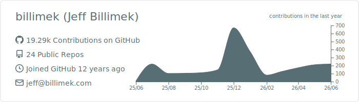
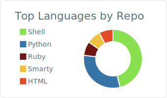
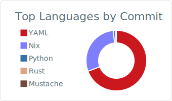
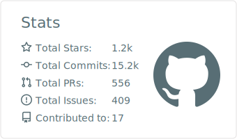
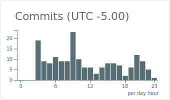

<picture>
  <source
    media="(prefers-color-scheme: dark)"
    srcset="./profile-summary-card-output/github_dark/0-profile-details.svg"
  />
  
</picture>

<picture>
  <source
    media="(prefers-color-scheme: dark)"
    srcset="./profile-summary-card-output/github_dark/1-repos-per-language.svg"
  />
  
</picture>
<picture>
  <source
    media="(prefers-color-scheme: dark)"
    srcset="./profile-summary-card-output/github_dark/2-most-commit-language.svg"
  />
  
</picture>

<picture>
  <source
    media="(prefers-color-scheme: dark)"
    srcset="./profile-summary-card-output/github_dark/3-stats.svg"
  />
  
</picture>
<picture>
  <source
    media="(prefers-color-scheme: dark)"
    srcset="./profile-summary-card-output/github_dark/4-productive-time.svg"
  />
  
</picture>
